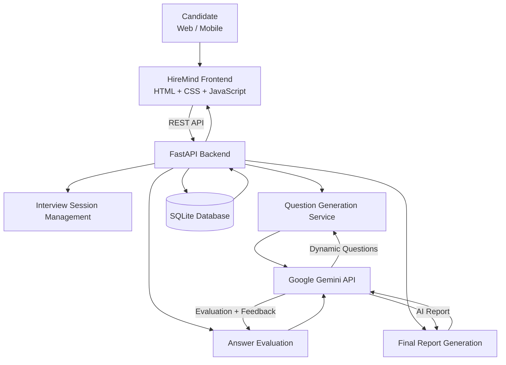

# HireMind — AI Interview Simulator

> An AI-powered mock interview platform that dynamically generates technical interview questions using Gemini, evaluates candidate responses, and provides personalized interview feedback.

## 🚀 Overview

**HireMind** is an AI-powered interview simulation platform designed to help students and aspiring developers practice technical and HR interviews in a realistic environment.

Instead of relying only on a fixed set of predefined questions, HireMind uses **Google Gemini** to dynamically generate interview questions based on the candidate's:

* Academic year
* Branch
* Interview category
* Technical domain
* Selected subjects
* Company and role, when applicable

The platform then evaluates candidate responses using AI and generates a final performance report.

---

## ✨ Key Features

### 🤖 Dynamic AI Interview

* Gemini-generated interview questions
* **10 questions by default**
* Supports **12-question interviews**
* Progressive difficulty:

  * Easy
  * Medium
  * Hard
* Questions adapt to the candidate's academic level
* Questions are generated according to the selected domain and subjects

### 🧠 AI Answer Evaluation

Each response can be evaluated using Gemini based on:

* Relevance
* Technical correctness
* Completeness
* Clarity
* Depth
* Reasoning and application

### 📊 AI Performance Report

After completing an interview, HireMind generates an AI-assisted report containing:

* Overall performance
* Question-level evaluation
* Strengths
* Areas for improvement
* Performance insights

> **AI feedback is a guide, not a final judgment.**

### 🎤 Multiple Answer Modes

Candidates can practice using:

* Text answers
* Voice input
* Webcam practice environment

### 📚 Interview Categories

HireMind supports interview configurations such as:

* HR
* Software Developer
* Web Developer
* Data Analyst
* Custom interviews
* Company-specific preparation

### 📱 Responsive Design

The interface is designed to adapt across:

* Mobile phones
* Tablets
* Laptops
* Desktop screens

The mobile interface uses responsive layouts, compact components, and touch-friendly controls.

### 💾 Interview History

Interview sessions and performance information can be retained through the application's existing storage/database architecture.

### 📴 Offline Fallback

If Gemini generation is unavailable, HireMind can fall back to the existing curated question bank so that the interview experience can continue.

---

# 🏗️ System Architecture



---

# 🔄 Interview Workflow

```text
Candidate
    │
    ▼
Select Interview Configuration
    │
    ├── Category
    ├── Academic Year
    ├── Branch
    ├── Domain
    ├── Subjects
    └── Company / Role (optional)
    │
    ▼
Create Interview Session
    │
    ▼
Gemini Generates Interview
    │
    ├── Question 1
    ├── Question 2
    ├── ...
    └── Question 10
    │
    ▼
Candidate Answers
    │
    ▼
Gemini Evaluates Answer
    │
    ▼
Next Question
    │
    ▼
Complete Interview
    │
    ▼
Gemini Generates Final Report
    │
    ▼
Performance Feedback
```

---

# 🧩 AI Architecture

HireMind currently uses a controlled AI pipeline rather than generating a new question after every answer.

For a standard 10-question interview:

```text
1 Gemini call
        ↓
Generate 10 interview questions
        ↓
Candidate answers
        ↓
Up to 10 Gemini evaluation calls
        ↓
1 Gemini report-generation call
```

This keeps the interview architecture relatively simple while controlling unnecessary API usage.

### Typical maximum

```text
Question generation       1 call
Answer evaluations       10 calls
Final report              1 call
────────────────────────────────
Total                    12 calls
```

A 12-question interview can use up to approximately 14 calls under the same architecture.

---

# 🛠️ Technology Stack

## Frontend

* HTML5
* CSS3
* JavaScript
* Responsive CSS
* LocalStorage-based client-side state where applicable

## Backend

* Python
* FastAPI
* Pydantic
* SQLAlchemy
* SQLite

## AI

* Google Gemini API

## Development Tools

* Visual Studio Code
* Git
* GitHub
* GitHub Desktop
* AntiGravity IDE

---

# 📁 Project Structure

```text
HireMind-AI-Interview/
│
├── backend/
│   ├── ai_service.py
│   ├── crud.py
│   ├── database.py
│   ├── main.py
│   ├── models.py
│   ├── question_bank.py
│   └── schemas.py
│
├── index.html
├── styles.css
├── app.js
│
├── requirements.txt
├── .env.example
├── .gitignore
└── README.md
```

> The exact project structure may evolve as the application develops.

---

# 🔌 Backend API

The FastAPI backend provides endpoints for the interview lifecycle.

### Create Interview Session

```http
POST /api/sessions/
```

Creates a new interview session using the selected candidate configuration.

### Generate Questions

```http
POST /api/sessions/{session_id}/generate-questions
```

Generates and stores the interview questions.

Default:

```text
10 questions
```

Optional:

```text
12 questions
```

### Evaluate Answer

```http
POST /api/questions/{question_id}/evaluate
```

Evaluates a candidate's response using the generated question and submitted answer.

### Generate Final Report

```http
POST /api/sessions/{session_id}/generate-report
```

Generates the final AI-assisted interview report.

---

# 🔐 Security

The Gemini API key is kept **server-side**.

The application uses:

```text
GEMINI_API_KEY
```

through environment configuration.

The API key should never be placed inside:

* `app.js`
* `index.html`
* CSS
* GitHub source code
* Database records
* Screenshots

For local development, use an environment file that is excluded through `.gitignore`.

For deployment, configure the secret through the hosting platform's environment-variable settings.

---

# ⚙️ Local Setup

## 1. Clone the repository

```bash
git clone <YOUR_REPOSITORY_URL>
cd HireMind-AI-Interview
```

## 2. Create a virtual environment

Windows:

```bash
python -m venv venv
```

Activate it:

```bash
venv\Scripts\activate
```

## 3. Install dependencies

```bash
pip install -r requirements.txt
```

## 4. Configure environment variables

Create a `.env` file:

```env
GEMINI_API_KEY=your_gemini_api_key
```

Never commit the `.env` file.

## 5. Start the FastAPI backend

```bash
uvicorn backend.main:app --reload
```

Then open the application through the configured frontend/server setup.

---

# 📱 Responsive Experience

HireMind uses responsive CSS to support different screen sizes rather than targeting a single phone model.

The interface has been refined for viewport widths including approximately:

```text
320px
360px
375px
390px
412px
430px
600px
768px+
```

Mobile-specific improvements include:

* Smaller interface icons
* Compact interview setup cards
* Responsive typography
* Touch-friendly controls
* Responsive question layouts
* Wrapped question indicators
* Mobile-friendly answer areas
* Responsive final reports
* Reduced unnecessary spacing
* Prevention of horizontal overflow

---

# 📴 Offline Fallback

HireMind maintains a curated question bank as a fallback mechanism.

If dynamic Gemini question generation is unavailable because of an API or backend issue, the application can use the existing question bank instead.

The fallback is kept separate from the normal Gemini-generated interview flow.

---

# 🔮 Version 2 Roadmap

The following capabilities are planned for future development and are **not part of the current V1 implementation**:

### 📄 Resume-Based Interviews

Analyze an uploaded resume and generate interview questions based on:

* Projects
* Skills
* Experience
* Technologies

### 👁️ Computer Vision

Potential future interview-analysis capabilities include:

* Eye-contact analysis
* Posture analysis
* Head movement analysis
* Other visual interview signals

These features are intentionally separated from the current V1 architecture.

---

# 🎯 Project Goal

HireMind aims to make interview preparation more accessible by combining:

```text
Personalized Configuration
          +
Dynamic AI Questions
          +
AI Answer Evaluation
          +
Performance Feedback
          =
Interactive Interview Practice
```

The goal is to provide students with a practical environment where they can repeatedly practice interviews and understand areas that need improvement.

---

# 📸 Screenshots

Screenshots of the following interfaces can be added here:

### Dashboard

`Add dashboard screenshot here`

### Interview Setup

`Add interview setup screenshot here`

### AI Interview

`Add interview screenshot here`

### AI Performance Report

`Add report screenshot here`

### Mobile Interface

`Add mobile screenshot here`

---

# 🚀 Deployment

The backend can be deployed using a Python-compatible hosting platform such as Render.

Production deployment should configure:

```text
GEMINI_API_KEY
```

through the hosting provider's environment variables.

> For persistent production data, the SQLite database should eventually be replaced with a persistent database such as PostgreSQL because ephemeral hosting environments may not preserve local SQLite files across deployments/restarts.

---

# 👨‍💻 Project

**HireMind — AI Interview Simulator**

Built as an AI-assisted interview preparation platform combining web technologies, FastAPI, database management, and Google's Gemini API.

---

## 📄 License

License information can be added when the project licensing decision is finalized.
